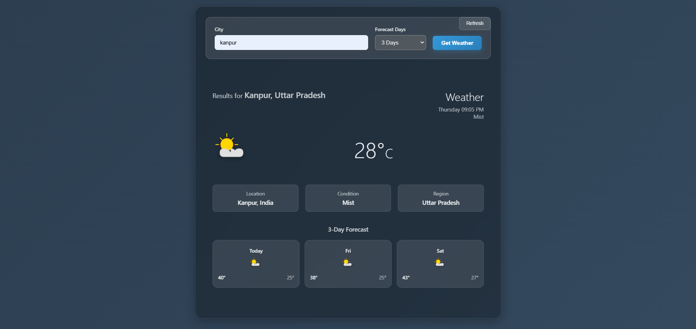

# SkyCast 🌤️

SkyCast is a full-stack weather dashboard built with Spring Boot and vanilla JavaScript that provides current weather conditions and forecast data. It integrates with an external weather API, processes and structures the data in the backend, and dynamically renders it on a responsive frontend interface.

---

## 🚀 Features

- 🌍 Search weather by city
- 📊 Current weather conditions
- 📅 Forecast data (API-limited)
- ⚡ Fast backend using Spring Boot
- 🎨 Responsive UI with clean design
- 🔗 REST API integration

---

## 🛠️ Tech Stack

**Backend:**
- Java
- Spring Boot
- REST API (Weather API)

**Frontend:**
- HTML
- CSS
- Vanilla JavaScript

---

## ⚙️ How to Run

1. Clone the repository:
```bash
git clone  https://github.com/ayushkushwaha-12/SkyCastt
```
2. Navigate to the project folder:
```bash
cd skycast
```
3. Add your API key in application.properties:
```bash
weather.api.key=YOUR_API_KEY
```
4. Run the Spring Boot application:
```bash
mvn spring-boot:run
```
5. Open in browser:
```bash
http://localhost:8082
```

---

## 📸 Preview
<p align="center">
  
</p>
